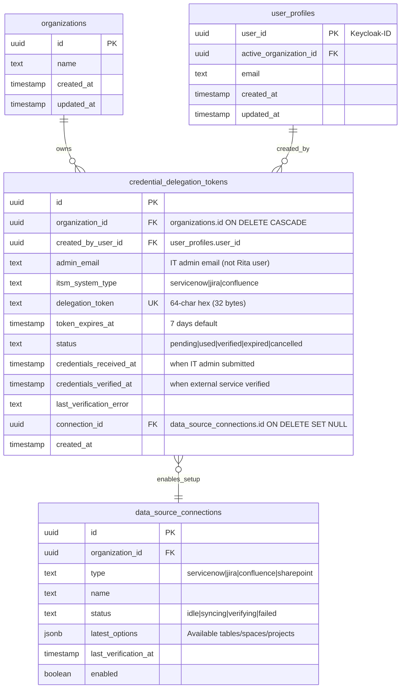

# Technical Design Document: RITA Credential Delegation

**Status:** v1.0
**Date:** November 26, 2025
**Feature:** Delegated ITSM Credential Setup for ServiceNow, Jira, and Confluence

-----

## 1. Executive Summary

This document outlines the architecture for RITA's Credential Delegation system. It enables RITA Autopilot owners to securely delegate ITSM credential setup to external IT administrators without requiring them to create RITA user accounts.

**Key Architectural Decisions:**

* **Zero Credential Storage:** Rita NEVER stores ITSM credentials - they pass through in memory only and are immediately sent to external service
* **Magic Link Pattern:** 64-character hex token (256-bit entropy) with 7-day expiration
* **Single-Use Enforcement:** Atomic database update prevents token reuse (race condition protection)
* **Real-Time Feedback:** SSE events and polling for verification status

**Related Documentation:**
- [Autopilot Ticket Clustering](../feat-autopilot-ticket-cluster/technical-design-autopilot-tickets.md) - Uses credentials configured via this system

-----

## 2. Delegation Flow

**Use Case:** RITA Autopilot Owner needs to connect ServiceNow or Jira for ticket ingestion, but does not have ITSM administrator credentials.

**Solution:** Secure, ephemeral "magic link" system that allows an external IT Admin to input sensitive credentials without creating a RITA user account.

### 2.1 Security Model

* **Zero Credential Storage:** Rita NEVER stores ITSM credentials - they pass through in memory only and are immediately sent to external service
* **Magic Link Pattern:** 64-character hex token (256-bit entropy) with 7-day expiration
* **Single-Use Enforcement:** Atomic database update prevents token reuse (race condition protection)
* **Real-Time Feedback:** SSE events notify both delegator and delegate of verification status
* **Audit Trail:** All delegation and verification actions logged for SOC2 compliance

### 2.2 Supported Systems

* **ServiceNow** - Username/password or API token authentication
* **Jira** - API token + email authentication
* **Confluence** - API token + email authentication (optional delegation for private instances)

### 2.3 Sequence Diagram

```mermaid
sequenceDiagram
    autonumber
    actor Owner as Owner
    participant Client as Rita Client
    participant Backend as Rita Backend
    participant DB as PostgreSQL
    actor Admin as IT Admin (External)
    participant Webhook as Workflow Platform
    participant Queue as RabbitMQ

    Note over Owner,Queue: PHASE 1: Delegation Creation

    Owner->>Client: Navigate to ServiceNow setup<br/>Click "Delegate to IT Admin"
    Client->>Backend: POST /credential-delegations/create<br/>{admin_email, system_type: "servicenow"}

    Backend->>DB: Check no pending delegation exists<br/>(admin_email + org + system_type)
    DB-->>Backend: No duplicate found

    Backend->>Backend: Generate secure token<br/>crypto.randomBytes(32).toString('hex')
    Backend->>DB: INSERT credential_delegation_tokens<br/>(token, status='pending', expires_at=7days)
    Backend->>DB: INSERT audit_logs<br/>(action: 'create_credential_delegation')

    Backend->>Webhook: POST webhook<br/>source: 'rita-credential-delegation'<br/>action: 'send_delegation_email'<br/>tenant_id, user_id, user_email<br/>admin_email, delegation_url, organization_name, itsm_system_type
    Note right of Webhook: Workflow Platform sends email<br/>with magic link to IT Admin

    Backend-->>Client: 200 {delegation_id, expires_at, status: "pending"}
    Client-->>Owner: "Invitation sent to admin@company.com"

    Note over Admin,Client: PHASE 2: IT Admin Receives & Clicks Link

    Note over Admin: IT Admin receives email<br/>and clicks magic link
    Admin->>Client: Click link → /credential-setup?token=xxx

    Client->>Backend: GET /credential-delegations/verify/:token
    Backend->>DB: SELECT * FROM credential_delegation_tokens<br/>WHERE token=$1 AND status='pending'<br/>AND expires_at > NOW()

    alt Token Valid
        DB-->>Backend: Return delegation details
        Backend-->>Client: 200 {valid: true, org_name, system_type, delegated_by}
        Client-->>Admin: Display credential form<br/>(ServiceNow URL, username, password)
    else Token Invalid/Expired
        DB-->>Backend: No match found
        Backend-->>Client: 400 {valid: false, reason: "expired"}
        Client-->>Admin: "This link has expired or been used"
    end

    Note over Admin,Webhook: PHASE 3: Credential Submission

    Admin->>Client: Fill form & click "Verify Credentials"<br/>{url, username, password}

    Client->>Backend: POST /credential-delegations/submit<br/>{token, credentials}

    Backend->>DB: BEGIN TRANSACTION
    Backend->>DB: UPDATE credential_delegation_tokens<br/>SET status='used', credentials_received_at=NOW()<br/>WHERE token=$1 AND status='pending'<br/>RETURNING id

    alt Update Successful (Single-Use Enforcement)
        DB-->>Backend: Row updated, return id

        Backend->>DB: UPSERT data_source_connections<br/>(organization_id, type, status='verifying')<br/>ON CONFLICT (organization_id, type) DO UPDATE<br/>RETURNING id as connection_id
        Note right of Backend: Create/update connection record BEFORE webhook<br/>to get connection_id for webhook payload

        Backend->>DB: UPDATE credential_delegation_tokens<br/>SET connection_id=$1 WHERE id=$2
        Backend->>DB: COMMIT TRANSACTION

        Backend->>Backend: Base64 encode password<br/>(prevent accidental logging)

        Backend->>Webhook: POST webhook<br/>source: 'rita-chat'<br/>action: 'verify_credentials'<br/>tenant_id, user_id, user_email, connection_id<br/>connection_type: 'servicenow'|'jira'<br/>credentials: {username, password (base64)}
        Note right of Webhook: Workflow Platform validates<br/>credentials against ServiceNow API

        Backend-->>Client: 202 {status: "verifying", polling_url: "/status/:token"}
        Client-->>Admin: Show spinner + start polling every 3s

        loop Poll every 3 seconds (max 30s)
            Client->>Backend: GET /credential-delegations/status/:token
            Backend->>DB: SELECT status FROM credential_delegation_tokens<br/>WHERE token=$1
            alt Still Verifying (status='used')
                Backend-->>Client: 200 {status: "verifying"}
                Client-->>Admin: Continue showing spinner
            end
        end

        Note over Client,Admin: Polling continues until status changes<br/>or 30s timeout (see Phase 4)

    else Already Used (Race Condition)
        DB-->>Backend: 0 rows updated
        Backend->>DB: ROLLBACK TRANSACTION
        Backend-->>Client: 409 {error: "Token already used"}
        Client-->>Admin: "This link has already been used"
    end

    Note over Webhook,Queue: PHASE 4: Async Verification Result

    alt Credentials Valid
        Webhook->>Webhook: Test connection to ServiceNow<br/>Store credentials securely<br/>(tenant_id + connection_id + type)

        Webhook->>Queue: Publish data_source_status<br/>{type: "verification", connection_id, tenant_id,<br/>status: "success", options: {tables: "..."}}

        Queue->>Backend: Consume verification message
        Backend->>DB: BEGIN TRANSACTION
        Backend->>DB: UPDATE credential_delegation_tokens<br/>SET status='verified', credentials_verified_at=NOW()
        Backend->>DB: UPDATE data_source_connections<br/>SET status='idle', enabled=true,<br/>latest_options=$options, last_verification_at=NOW()
        Note right of Backend: Connection record already exists<br/>(created during credential submission)
        Backend->>DB: INSERT audit_logs<br/>(action: 'credential_verification_success')
        Backend->>DB: COMMIT TRANSACTION

        Backend--)Client: SSE Event: data_source_update<br/>{connection_id, connection_type: "servicenow", status: "idle"}
        Client-->>Owner: Toast: "ServiceNow credentials verified ✓"

        Note over Client,Admin: Next poll detects status='verified'
        Client->>Backend: GET /credential-delegations/status/:token
        Backend->>DB: SELECT status, connection_id
        Backend-->>Client: 200 {status: "success", connection_id}
        Client-->>Admin: Success: "Credentials verified!<br/>You can close this page."

        Backend->>Webhook: POST webhook (optional)<br/>action: 'send_verification_result_email'<br/>admin_email, verification_status: "success"
        Note right of Webhook: Email notification sent to IT Admin

    else Credentials Invalid
        Webhook->>Queue: Publish data_source_status<br/>{type: "verification", connection_id, tenant_id,<br/>status: "failed", error: "Invalid credentials..."}

        Queue->>Backend: Consume verification message
        Backend->>DB: UPDATE credential_delegation_tokens<br/>SET status='pending',<br/>last_verification_error='Invalid credentials'

        Note over Client,Admin: Next poll detects status='pending'
        Client->>Backend: GET /credential-delegations/status/:token
        Backend->>DB: SELECT status, last_verification_error
        Backend-->>Client: 200 {status: "failed", error, allow_retry: true}
        Client-->>Admin: Error: "Invalid credentials. Please try again."<br/>(Form remains editable, can retry)

        Backend->>Webhook: POST webhook<br/>action: 'send_verification_result_email'<br/>admin_email, verification_status: "failed", error
        Note right of Webhook: Email notification sent to IT Admin
    end

    alt Polling Timeout (30 seconds)
        Note over Client,Admin: Status still 'used' after 10 polls
        Client-->>Admin: "Verification taking longer than expected.<br/>We'll email you at {admin_email} when complete."
        Note right of Admin: IT Admin can close page.<br/>Will receive email when verification completes.
    end

    Note over Owner,Client: PHASE 5: Setup Complete

    Owner->>Client: Refresh data sources page
    Client->>Backend: GET /data-sources
    Backend->>DB: SELECT * FROM data_source_connections<br/>WHERE organization_id=$1
    DB-->>Backend: Return all connections (ServiceNow now enabled=true)
    Backend-->>Client: Return data sources
    Client-->>Owner: ServiceNow card shows:<br/>Status: "Configured ✓"<br/>"Last verified: 2 minutes ago"
```



### 2.4 Key Features

**Token Security:**
- Generated using `crypto.randomBytes(32).toString('hex')` (matches invitation system pattern)
- 7-day expiration (configurable)
- Single-use atomic enforcement prevents race conditions
- Rate limiting: 10 delegations per org per day

**Zero Credential Storage:**
- Credentials never persisted to Rita database
- Passed in memory only from frontend → API → webhook → external service
- Base64 encoding prevents accidental logging
- External service stores credentials using composite key: `(tenant_id, connection_id, connection_type)`

**Real-Time Updates:**
- IT Admin sees verification result via polling
- RITA Owner receives toast notification when setup completes via SSE
- Both parties get immediate feedback on success/failure

**Audit Compliance (SOC2):**
- Who created delegation (RITA Owner user_id)
- Who submitted credentials (IT Admin email, IP address)
- When credentials verified (timestamp)
- All logged to `audit_logs` table

**Error Handling:**
- Invalid/expired token → User-friendly error message
- Credentials fail verification → Allow retry (token reverts to 'pending')
- Webhook failure → Logged to `rag_webhook_failures` with retry logic
- Race conditions → Atomic status updates prevent duplicate submissions

-----

## 3. Data Architecture

### 3.1 Entity Relationship Diagram



-----

## 4. Interface Contracts

### 4.1 Webhook Payloads

#### Credential Delegation Email Webhook

**Webhook:** Workflow Platform
**Action:** `send_delegation_email`
**Purpose:** Send magic link email to IT Admin for delegated credential setup

```json
{
  "source": "rita-credential-delegation",
  "action": "send_delegation_email",
  "tenant_id": "org-uuid-123",
  "user_id": "creator-uuid-456",
  "user_email": "owner@company.com",
  "admin_email": "itadmin@company.com",
  "delegation_url": "https://rita.app/credential-setup?token=abc123...",
  "organization_name": "Acme Corp",
  "itsm_system_type": "servicenow",
  "delegation_token_id": "token-uuid-789",
  "expires_at": "2025-12-01T10:00:00Z",
  "timestamp": "2025-11-24T10:00:00Z"
}
```

**Required Fields:**
- `source`, `action`, `tenant_id`, `user_id`, `user_email` - Standard webhook fields
- `admin_email` - IT Admin recipient email (not a Rita user)
- `delegation_url` - Full URL with secure token for credential setup page
- `organization_name` - For email personalization
- `itsm_system_type` - System being configured: `servicenow`, `jira`, or `confluence`
- `timestamp` - ISO 8601 timestamp

**Optional Fields:**
- `delegation_token_id` - For external tracking/logging
- `expires_at` - Token expiry (7 days default)

**Error Handling:**
- Webhook failures logged to `rag_webhook_failures` table
- Retry: 3 attempts with exponential backoff
- Non-retryable errors (4xx) marked as `dead_letter`

---

#### Credential Verification Webhook

**Webhook:** Workflow Platform
**Action:** `verify_credentials`
**Purpose:** Validate ITSM credentials and store securely in external service

```json
{
  "source": "rita-chat",
  "action": "verify_credentials",
  "tenant_id": "org-uuid-123",
  "user_id": "creator-uuid-456",
  "user_email": "owner@company.com",
  "connection_id": "conn-uuid-789",
  "connection_type": "servicenow",
  "credentials": {
    "username": "admin@company.com",
    "password": "YmFzZTY0RW5jb2RlZFBhc3N3b3Jk"
  },
  "settings": {
    "url": "https://company.service-now.com"
  },
  "timestamp": "2025-11-24T10:00:00Z"
}
```

**Connection Types:**
- `servicenow` - Basic auth (username/password)
- `jira` - API token + email
- `confluence` - API token + email

**ServiceNow Credentials:**
```json
{
  "credentials": {
    "username": "admin@company.com",
    "password": "YmFzZTY0RW5jb2RlZA=="
  },
  "settings": {
    "url": "https://company.service-now.com"
  }
}
```

**Jira/Confluence Credentials:**
```json
{
  "credentials": {
    "api_token": "ATATT3xFfGF0...",
    "email": "user@company.com"
  },
  "settings": {
    "url": "https://company.atlassian.net"
  }
}
```

**Security:**
- Password base64 encoded to prevent accidental logging
- Credentials transmitted over HTTPS only
- Rita NEVER stores credentials in database
- External service stores with composite key: `(tenant_id, connection_id, connection_type)`

**Response:** HTTP 200 (synchronous acknowledgment)
**Result:** Arrives asynchronously via RabbitMQ `data_source_status` queue

---

### 4.2 RabbitMQ Payloads

**Queue:** `data_source_status`
*Purpose: Async credential verification results for all data source types (ServiceNow, Jira, Confluence).*

**Success Message:**
```json
{
  "type": "verification",
  "connection_id": "conn-uuid-789",
  "tenant_id": "org-uuid-123",
  "status": "success",
  "options": {
    "tables": "incident,problem,change_request"
  },
  "error": null
}
```

**Failure Message:**
```json
{
  "type": "verification",
  "connection_id": "conn-uuid-789",
  "tenant_id": "org-uuid-123",
  "status": "failed",
  "options": null,
  "error": "Invalid credentials or insufficient permissions"
}
```

**Options by Connection Type:**
- ServiceNow: `{"tables": "incident,problem,change_request"}` - Comma-separated table names
- Jira: `{"projects": "PROJ1,PROJ2,PROJ3"}` - Comma-separated project keys
- Confluence: `{"spaces": "ENG,PROD,DOCS"}` - Comma-separated space keys

---

### 4.3 API Endpoints

**Authentication & Authorization:**
- Public endpoints use token-based auth (delegation token IS the auth)
- Authenticated endpoints require Keycloak JWT token

#### Credential Delegation Endpoints

* **`POST /api/credential-delegations/create`**
    * Payload: `{ "admin_email": string, "itsm_system_type": "servicenow" | "jira" | "confluence" }`
    * Authorization: Requires `admin` or `owner` role
    * Action: Generate 64-char token, INSERT credential_delegation_tokens, send email via webhook
    * Webhook Call: `WebhookService.sendCredentialDelegationEmail()`
        - source: `'rita-credential-delegation'`, action: `'send_delegation_email'`
        - Includes: tenant_id, user_id, user_email, admin_email, delegation_url, organization_name, itsm_system_type
        - Failures logged to `rag_webhook_failures` table
        - Retry: 3 attempts with exponential backoff
    * Rate limit: 10 delegations per org per day
    * Audit: Logs to `audit_logs` with action `create_credential_delegation`
    * Returns: `{ delegation_id, delegation_url, expires_at, status: "pending" }`

* **`GET /api/credential-delegations/verify/:token`** (Public)
    * Authorization: None (public endpoint)
    * Action: Validate token exists, not expired, status='pending'
    * Returns: `{ valid: boolean, org_name, system_type, delegated_by, expires_at }` or `{ valid: false, reason }`

* **`GET /api/credential-delegations/status/:token`** (Public)
    * Authorization: None (token is auth)
    * Purpose: Poll verification status for IT Admin real-time feedback
    * Action: Check delegation token status
    * Returns based on status:
        - `status='used'`: `{ status: "verifying", message: "Checking credentials..." }`
        - `status='verified'`: `{ status: "success", message: "Credentials verified!", connection_id: "uuid" }`
        - `status='pending'` (after failure): `{ status: "failed", error: "Invalid credentials or insufficient permissions", allow_retry: true }`
        - Token not found / wrong status: `404 { error: "Invalid or expired token" }`
    * Rate limit: 20 requests per minute per token
    * Used by IT Admin page for polling after credential submission
    * Typical polling: Every 3 seconds for max 30 seconds (10 polls)

* **`POST /api/credential-delegations/submit`** (Public)
    * Payload: `{ "token": string, "credentials": { url, username, password, ... } }`
    * Authorization: None (public endpoint)
    * Action: Atomic update status='used', send webhook for verification, credentials NOT stored
    * Webhook Call: `DataSourceWebhookService.sendVerifyEvent()`
        - source: `'rita-chat'`, action: `'verify_credentials'`
        - connection_type: `'servicenow'|'jira'|'confluence'` (identifies system)
        - Includes: tenant_id, user_id, user_email, connection_id, credentials (password base64 encoded), settings
        - Same pattern as Confluence verification
        - Result arrives async via RabbitMQ `data_source_status` queue
    * Returns: `202 { status: "verifying", polling_url: "/api/credential-delegations/status/:token" }` (result via polling)
    * Frontend: Immediately starts polling status endpoint every 3s
    * Error: 409 if token already used (race condition prevention)

* **`GET /api/credential-delegations`**
    * Query: `?status=pending|used|verified&system_type=servicenow|jira`
    * Authorization: Requires `member` role or higher
    * Returns: List of delegations for organization `[{ id, admin_email, system_type, status, created_at, expires_at, verified_at }]`

-----

## 5. Implementation Strategy

### 5.1 Backend Consumer Logic

**Consumer:** `DataSourceStatusConsumer.ts` (packages/api-server/src/consumers/)
*Reuses existing consumer for both Confluence verification AND delegated ITSM setup*

1.  **Data Source Verification Processing:**
    * **Queue:** `data_source_status`
    * **Message Format:** `{ type: 'verification', connection_id, tenant_id, status: 'success'|'failed', options?, error? }`

    * **Organization Context:**
      * Extract `tenant_id` from message payload (maps to organization_id)
      * Set PostgreSQL session variable: `SET LOCAL app.current_organization_id = 'org-uuid'`

    * **Transaction Scope:**
      * BEGIN TRANSACTION on message receipt
      * COMMIT only after all updates complete
      * ROLLBACK on database errors

    * **Success Flow (status='success'):**
      ```sql
      -- Update data source connection
      UPDATE data_source_connections
      SET status = 'active',
          latest_options = $2,  -- JSONB: {tables: "..."} or {spaces: "..."} or {projects: "..."}
          last_verification_at = NOW(),
          enabled = true,
          updated_at = NOW()
      WHERE id = $1;

      -- If triggered by delegation: lookup token by connection_id
      UPDATE credential_delegation_tokens
      SET status = 'verified',
          credentials_verified_at = NOW()
      WHERE connection_id = $1 AND status = 'used';

      -- Audit log (if delegation triggered)
      INSERT INTO audit_logs (
        organization_id, user_id, action, resource_type, resource_id, metadata
      )
      SELECT organization_id, created_by_user_id, 'credential_verification_success',
             'credential_delegation', id, jsonb_build_object('connection_id', connection_id)
      FROM credential_delegation_tokens
      WHERE connection_id = $1;
      ```

    * **Failure Flow (status='failed'):**
      ```sql
      -- Update data source connection
      UPDATE data_source_connections
      SET status = 'failed',
          updated_at = NOW()
      WHERE id = $1;

      -- If triggered by delegation: revert to pending (allow retry)
      UPDATE credential_delegation_tokens
      SET status = 'pending',
          last_verification_error = $2
      WHERE connection_id = $1 AND status = 'used';
      ```

    * **SSE Event Emission:**
      * Success: `sendToOrganization(tenant_id, { type: 'credential_verified', connection_type, connection_id })`
      * Failure: `sendToOrganization(tenant_id, { type: 'credential_failed', error })`

    * **Email Notification (Delegation Flow Only):**
      ```typescript
      // After updating credential_delegation_tokens status
      const delegation = await db.query(
        'SELECT admin_email, organization_id FROM credential_delegation_tokens WHERE connection_id = $1',
        [connection_id]
      );

      if (delegation) {
        // Send email notification to IT Admin
        await webhookService.sendGenericEvent({
          organizationId: delegation.organization_id,
          source: 'rita-credential-delegation',
          action: 'send_verification_result_email',
          additionalData: {
            admin_email: delegation.admin_email,
            verification_status: status === 'success' ? 'verified' : 'failed',
            itsm_system_type: connectionType,
            error: status === 'failed' ? errorMessage : null
          }
        });
      }
      ```

    * **Detecting Delegation vs Direct Verification:**
      * Query `credential_delegation_tokens` by `connection_id`
      * If found with status='used' → delegation flow (update delegation record)
      * If not found → direct verification (Confluence pattern, no delegation updates needed)

    * **Error Handling:**
      * Invalid organization → Log warning, NACK message (don't requeue)
      * Database errors → Log error, NACK message with requeue (max 3 retries)
      * Connection not found → Log warning, ACK message (idempotent)

### 5.2 Frontend State (React)

**Status Polling (IT Admin - Public Page):**
```typescript
// After credential submission (POST /credential-delegations/submit)
const pollVerificationStatus = async (token: string) => {
  const MAX_POLLS = 10; // 30 seconds total (3s interval)
  const POLL_INTERVAL = 3000; // 3 seconds
  let attempts = 0;

  const interval = setInterval(async () => {
    attempts++;

    try {
      const response = await fetch(`/api/credential-delegations/status/${token}`);
      const data = await response.json();

      if (data.status === 'success') {
        clearInterval(interval);
        showSuccessMessage('Credentials verified! You can close this page.');
        // Optionally disable form
      } else if (data.status === 'failed') {
        clearInterval(interval);
        showErrorMessage(data.error);
        // Re-enable form for retry
      } else if (attempts >= MAX_POLLS) {
        // Timeout after 30 seconds
        clearInterval(interval);
        showTimeoutMessage(
          'Verification taking longer than expected. ' +
          'We\'ll email you at {admin_email} when complete.'
        );
      }
      // else status='verifying' → continue polling
    } catch (error) {
      console.error('Polling error:', error);
      // Continue polling on network errors
    }
  }, POLL_INTERVAL);

  // Cleanup on component unmount
  return () => clearInterval(interval);
};
```

**Polling Strategy:**
- Start immediately after submit (202 response)
- Poll every 3 seconds
- Max 10 attempts (30 seconds total)
- Clear interval on success/failure/timeout

**UX States:**
- Verifying: Show spinner + "Checking credentials..."
- Success: Green checkmark + "Credentials verified!"
- Failed: Error message + retry button
- Timeout: Info message + "Check your email"

-----

## 6. Security

### 6.1 Multi-Tenancy & Data Isolation

**Row-Level Security (RLS) Policy:**
```sql
ALTER TABLE credential_delegation_tokens ENABLE ROW LEVEL SECURITY;

CREATE POLICY "users_access_own_organization_delegations" ON credential_delegation_tokens
    FOR ALL
    USING (organization_id = current_setting('app.current_organization_id', true)::uuid);
```

### 6.2 SOC2 Type II Compliance

**Logged Actions (via `audit_logs` table):**
* `create_credential_delegation` - User initiates delegation
* `credential_verification_success` - Credentials verified
* `credential_verification_failed` - Credentials failed (logged but not exposed)

**Audit Log Retention:** Minimum 1 year for compliance

-----

## 7. Database Migration

### 7.1 credential_delegation_tokens Table

```sql
-- Delegated ITSM credential setup tokens
CREATE TABLE credential_delegation_tokens (
    id UUID PRIMARY KEY DEFAULT gen_random_uuid(),
    organization_id UUID NOT NULL REFERENCES organizations(id) ON DELETE CASCADE,
    created_by_user_id UUID NOT NULL REFERENCES user_profiles(user_id) ON DELETE CASCADE,

    -- Delegated admin info (not yet authenticated)
    admin_email TEXT NOT NULL,
    itsm_system_type TEXT NOT NULL CHECK (itsm_system_type IN ('servicenow', 'jira', 'confluence')),

    -- Token management
    delegation_token TEXT NOT NULL UNIQUE,
    token_expires_at TIMESTAMP WITH TIME ZONE NOT NULL,

    -- Status tracking
    status TEXT NOT NULL DEFAULT 'pending' CHECK (status IN ('pending', 'used', 'verified', 'expired', 'cancelled')),

    -- Credential submission tracking
    credentials_received_at TIMESTAMP WITH TIME ZONE,  -- when IT admin submitted
    credentials_verified_at TIMESTAMP WITH TIME ZONE,  -- when external service verified
    last_verification_error TEXT,

    -- Link to data source connection (set after verification webhook sent)
    connection_id UUID REFERENCES data_source_connections(id) ON DELETE SET NULL,

    -- Timestamps
    created_at TIMESTAMP WITH TIME ZONE DEFAULT NOW()
);

-- Indexes
CREATE INDEX idx_cred_delegation_email ON credential_delegation_tokens(admin_email);
CREATE INDEX idx_cred_delegation_token ON credential_delegation_tokens(delegation_token);
CREATE INDEX idx_cred_delegation_org_id ON credential_delegation_tokens(organization_id);
CREATE INDEX idx_cred_delegation_status ON credential_delegation_tokens(status);
CREATE INDEX idx_cred_delegation_expires_at ON credential_delegation_tokens(token_expires_at);
CREATE INDEX idx_cred_delegation_created_by ON credential_delegation_tokens(created_by_user_id);
CREATE INDEX idx_cred_delegation_connection_id ON credential_delegation_tokens(connection_id);

-- Unique constraint: prevent duplicate pending tokens
CREATE UNIQUE INDEX idx_cred_delegation_unique
    ON credential_delegation_tokens(admin_email, organization_id, itsm_system_type)
    WHERE status = 'pending';

-- Row-Level Security
ALTER TABLE credential_delegation_tokens ENABLE ROW LEVEL SECURITY;

CREATE POLICY "users_access_own_organization_delegations" ON credential_delegation_tokens
    FOR ALL
    USING (organization_id = current_setting('app.current_organization_id', true)::uuid);

-- Comments
COMMENT ON TABLE credential_delegation_tokens IS 'Delegated credential setup links for external ITSM admins';
COMMENT ON COLUMN credential_delegation_tokens.delegation_token IS '64-char hex token (32 random bytes) sent via email';
COMMENT ON COLUMN credential_delegation_tokens.admin_email IS 'Email of IT admin (not yet a Rita user)';
COMMENT ON COLUMN credential_delegation_tokens.itsm_system_type IS 'ServiceNow, Jira, or Confluence';
COMMENT ON COLUMN credential_delegation_tokens.status IS 'pending → used → verified (or back to pending on failure)';
COMMENT ON COLUMN credential_delegation_tokens.credentials_received_at IS 'When IT admin submitted credentials';
COMMENT ON COLUMN credential_delegation_tokens.credentials_verified_at IS 'When external service verified';
```

### 7.2 Migration Checklist

**Post-Migration:**
- [ ] Verify table created: `\dt credential_delegation_tokens`
- [ ] Verify indexes created: `\di idx_cred_delegation_*`
- [ ] Verify RLS policy enabled
- [ ] Verify CHECK constraints: status, itsm_system_type
- [ ] Verify UNIQUE constraint for pending tokens
- [ ] Test RLS isolation

### 7.3 Rollback Plan

```sql
-- Rollback script (if needed - DESTRUCTIVE!)
DROP TABLE IF EXISTS credential_delegation_tokens CASCADE;
```

**⚠️ Warning:** Rollback will permanently delete all delegation data.
